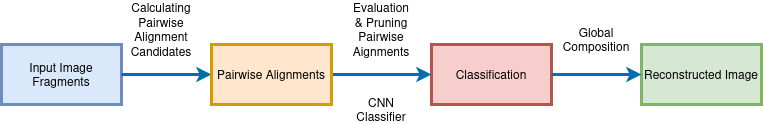
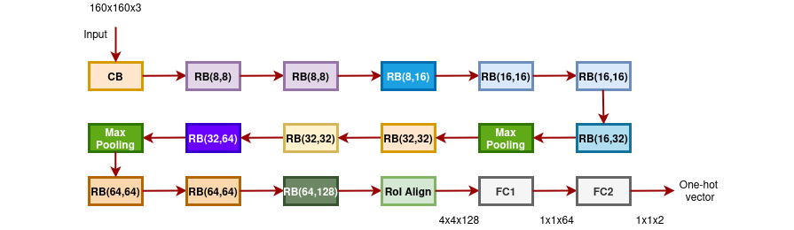
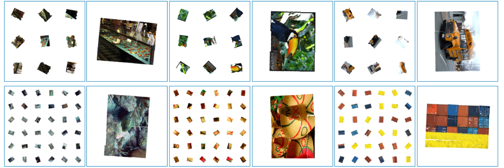

# ArtReconstruct_Piecing_together_Archaeological_Artworks

## Overview
An Innovative Machine Learning solution based on Hyperspectral Imaging techinique to handle missing parts and fragmented images ,mainly found fragments in Archeological discoveries.

## Table of Contents (soon be published)
1. [Installation](#installation)
2. [Usage](#usage)
3. [Features](#features)
4. [Contributing](#contributing)
5. [License](#license)

### Overall Model
 
### RoI CNN Model
 
### Final Reconstruction sample
 

## License
This project is licensed under the [MIT License](LICENSE).
